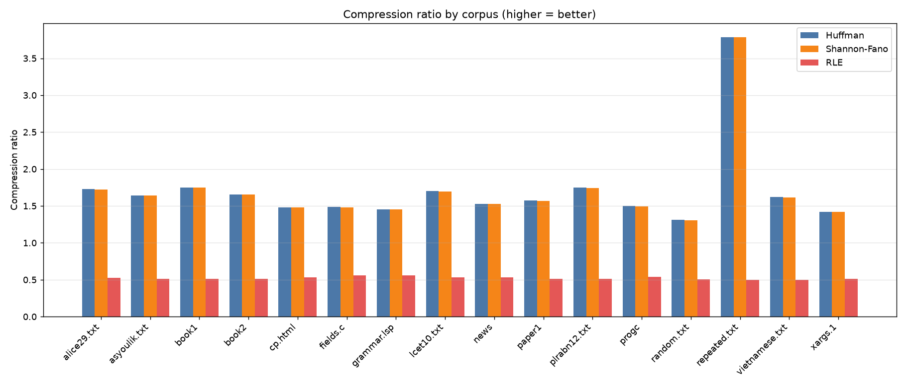

# Huffman Text Compressor — Bộ nén văn bản nhỏ dùng mã Huffman

Bộ nén văn bản **không mất dữ liệu (lossless)** dùng **mã Huffman**, viết bằng Python.
A small, lossless **text compressor** using **Huffman coding**, written in Python.

> Bài tập lớn môn *Application Algorithm*. Tài liệu song ngữ Việt–Anh.
> Quy trình phát triển theo phase: [.claude/TASKS.md](.claude/TASKS.md).

## ✨ Tính năng / Features

- Nén & giải nén **byte-exact** (an toàn UTF-8: tiếng Việt có dấu, emoji, và mọi dữ liệu nhị phân).
- Định dạng file `.huf` **tự chứa** (self-contained) — xem [docs/format.md](docs/format.md).
- CLI: `compress`, `decompress`, `stats`.
- Thống kê: compression ratio, space saving, BPC, entropy, average code length, thời gian.
- Benchmark vs **RLE** & **Shannon-Fano** trên **corpus chuẩn** (Canterbury, Calgary).
- Trực quan hoá: cây Huffman, histogram tần suất, biểu đồ so sánh.
- 80 test tự động, coverage core ≥ 90%.

## 📦 Cài đặt / Installation

Yêu cầu **Python ≥ 3.10**.

```bash
# 1) (khuyến nghị) tạo virtualenv
python -m venv .venv && source .venv/bin/activate   # Windows: .venv\Scripts\activate

# 2) cài gói (editable) kèm dev tools
pip install -e ".[dev]"
```

Không muốn cài đặt? Chạy trực tiếp bằng cách đặt `src/` lên `PYTHONPATH`:

```bash
PYTHONPATH=src python -m huffman.cli.main --help      # Linux/macOS
# Windows PowerShell:  $env:PYTHONPATH="src"; python -m huffman.cli.main --help
```

## 🚀 Cách dùng / Usage

```bash
# Nén một file
huffman compress input.txt -o input.huf

# Giải nén
huffman decompress input.huf -o output.txt

# Chỉ xem thống kê (không ghi file)
huffman stats input.txt
```

Ví dụ output của `stats`:

```
Original size    : 152089 bytes
Compressed size  : 88065 bytes
Compression ratio: 1.727 x
Space saving     : 42.10 %
Bits per char    : 4.632 bit/byte
Entropy (H)      : 4.568 bit/symbol
Avg code length  : 4.575 bit/symbol
```

## 📊 Kết quả tóm tắt / Results (corpus chuẩn)

Huffman **luôn ≥ Shannon-Fano** và BPC luôn **sát trên entropy H** (đúng `H ≤ L < H+1`). RLE phình văn bản (~2×). Số đầy đủ: [results/summary.md](results/summary.md).

| Corpus | Orig (B) | Huffman (B) | Ratio | Saving | H (bit) | BPC |
|--------|---------:|------------:|------:|-------:|--------:|----:|
| alice29.txt (Canterbury) | 152089 | 88065 | 1.73 | 42.1% | 4.568 | 4.63 |
| book1 (Calgary) | 768771 | 438791 | 1.75 | 42.9% | 4.527 | 4.57 |
| repeated.txt (low entropy) | 212000 | 56037 | 3.78 | 73.6% | 1.973 | 2.12 |
| random.txt (high entropy) | 101495 | 77551 | 1.31 | 23.6% | 6.066 | 6.11 |



## 🔁 Tái tạo kết quả / Reproduce

```bash
python data/make_synthetic.py          # sinh corpus random/repeated/vietnamese
PYTHONPATH=src python -m huffman.analysis.benchmark   # -> results/benchmark.csv, summary.md
PYTHONPATH=src python -m huffman.analysis.visualize   # -> results/figures/*.png
```

Corpus chuẩn (Canterbury/Calgary) tải bằng: xem [docs/user_guide.md](docs/user_guide.md#lấy-corpus-chuẩn).

## 🧪 Chạy test / Tests

```bash
pytest                       # 80 tests
pytest --cov=huffman         # kèm coverage
```

## 🗂️ Cấu trúc / Structure

```
src/huffman/     # mã nguồn, tách theo chức năng:
  ├─ core/         #   thuật toán + cấu trúc dữ liệu (huffman, tree, priority_queue)
  ├─ container/    #   đóng gói bit + định dạng .huf (bitstream, file_io)
  ├─ codec/        #   nén/giải nén (compressor, decompressor)
  ├─ common/       #   tiện ích + chỉ số dùng chung (utils, metrics)
  ├─ analysis/     #   baselines, benchmark, visualize
  └─ cli/          #   giao diện dòng lệnh (main)
tests/           # 80 test (unit, property, integration, CLI)
data/            # corpora (Canterbury, Calgary, synthetic)
results/         # benchmark.csv, summary.md, figures/
docs/            # requirements, theory, research, format, architecture, guides
report/          # báo cáo học thuật
slides/          # slide thuyết trình
```

## 📚 Tài liệu / Documentation

- Lý thuyết & chứng minh tối ưu: [docs/theory.md](docs/theory.md)
- Khảo sát thuật toán: [docs/research.md](docs/research.md)
- Kiến trúc: [docs/architecture.md](docs/architecture.md) · Định dạng file: [docs/format.md](docs/format.md)
- Hướng dẫn dùng: [docs/user_guide.md](docs/user_guide.md) · Nhà phát triển: [docs/developer_guide.md](docs/developer_guide.md)
- [docs/faq.md](docs/faq.md) · [docs/troubleshooting.md](docs/troubleshooting.md)
- Báo cáo đầy đủ: [report/report.md](report/report.md)

## 📄 License

MIT.
